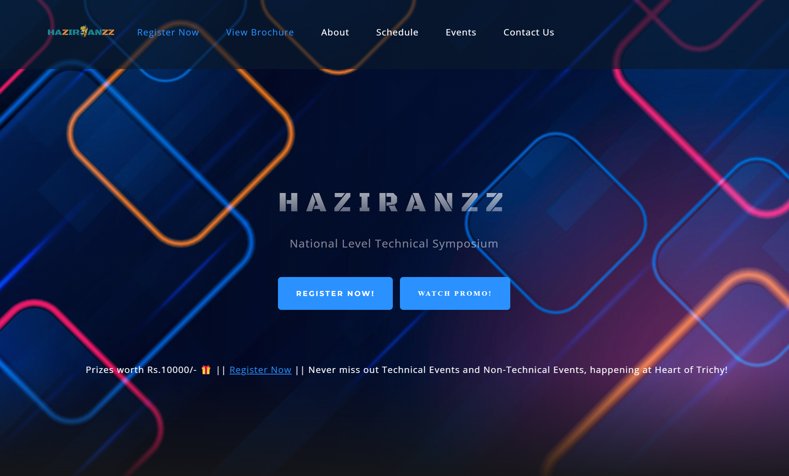

HAZIRANZZ

Overview
HAZIRANZZ is a multimedia-focused project designed to support event or symposium promotion through a custom-designed website and visually engaging assets. This repository combines HTML, CSS, and various multimedia elements to create a visually appealing, responsive web experience.

🚀 [Live Demo](https://haziranzz.netlify.app/)
Click the link above to try out the Data Visualizer app directly in your browser!

Features
- Responsive Web Design: Uses HTML and CSS to structure and style content, ensuring a seamless experience across devices.
- Engaging Multimedia: Includes videos and images for dynamic visual effects, enhancing the appeal and engagement level of the website.
- Easy Customization: Modifiable HTML structure and CSS styling for branding adjustments, making it adaptable to different event themes.

Project Structure
- index.html - Main webpage file for structuring content.
- style.css - Cascading Style Sheets (CSS) file for custom styling.
- /assets - Contains all multimedia assets like images and videos.
- /scripts - Optional folder for any interactive JavaScript.

Getting Started
1.Clone the repository:
   ```bash
   git clone https://github.com/hari777s/HAZIRANZZ.git
   ```
2. Open `index.html` in a browser to view the project locally.
3. Modify the HTML or CSS files as needed to fit your event’s branding and content.

Usage
- Replace images in the `/assets` folder to customize visual content.
- Adjust CSS in `style.css` to match branding guidelines.
- Embed additional media files as needed to enrich the promotional experience.

Screenshots



Contributing
Contributions are welcome! For major changes, please open an issue to discuss potential improvements.

---

This README provides a clear overview of the project’s purpose, structure, and usage guidelines. Let me know if you'd like more details on any section!
